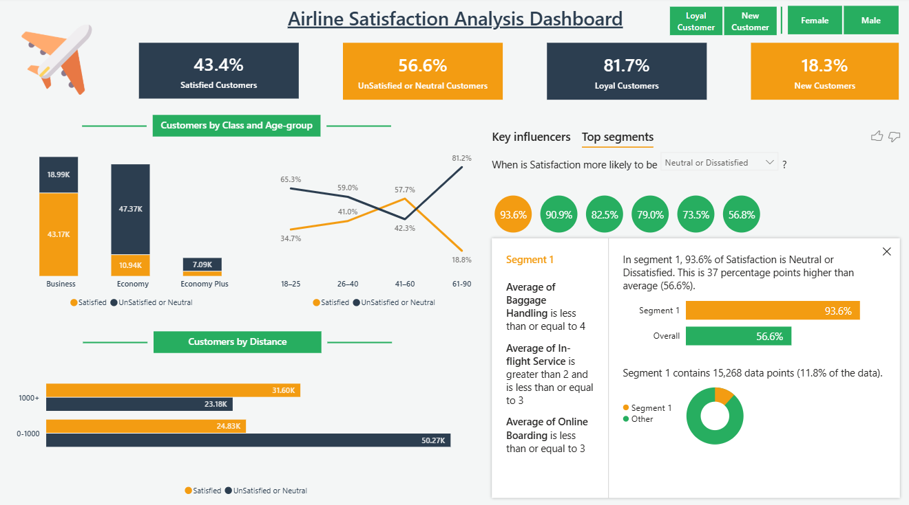

# Airline Passenger Satisfaction Dashboard

> Built to analyze airline customer experience, service quality, and dissatisfaction drivers using passenger data.

---

## Dashboard Preview

### Dashboard

This dashboard provides an overview of airline performance, highlighting customer satisfaction, loyalty, service quality, and key factors affecting passenger experience.

---

## Problem Statement

Airlines serve thousands of passengers daily, but understanding customer satisfaction remains a challenge. Key questions include:

- What percentage of passengers are satisfied?
- Does loyalty guarantee satisfaction?
- How do delays impact customer experience?
- Which class of passengers is most dissatisfied?
- What service factors drive satisfaction or dissatisfaction?
- Are certain customer segments at higher risk?

This dashboard answers these questions using data-driven insights.

---

## Dataset

[Airline Dataset](https://mavenanalytics.io/data-playground/airline-passenger-satisfaction)

### Dataset Details
- Total Records: **129,000+**  
- Data Type: Customer demographics, flight details, service ratings  
- Target Variable: **Satisfaction**

---

## Tools & Technologies Used

- **Power BI**
  - DAX Measures  
  - Interactive Dashboard  

---

## What I Analyzed

### Customer Behavior
- Satisfaction vs dissatisfaction distribution  
- Loyal vs new customers analysis  

### Flight Experience
- Impact of departure & arrival delays  
- Short vs. long-distance behavior  

### Class Analysis
- Economy vs Business class satisfaction comparison  

### Service Quality
- Online boarding  
- Baggage handling  
- In-flight service  
- Cleanliness & comfort  

### Segmentation
- High-risk customer segments  
- Key drivers of dissatisfaction  

---

## Key Metrics Created (DAX)

- Total Customers  
- Satisfied Customers %  
- Dissatisfied Customers %  
- Loyal Customers %  
- New Customers %  
- Customer Segments  

---

## Key Insights

- Only **43% customers are satisfied**, showing a clear gap in overall customer experience  
- Despite **81% loyal customers**, satisfaction remains low → indicating customers stay but are not truly happy  
- **Economy class passengers** face much higher dissatisfaction compared to Business class, highlighting service inequality  
- **Short-distance flights (<1000 km)** have nearly 2x more dissatisfied customers, likely due to delays and limited service time  
- Satisfaction is lowest among **younger (18–25) and older (60+) passengers**, suggesting unmet expectations in these groups  
- Poor **online boarding and baggage handling** have the strongest negative impact on satisfaction  
- When multiple service ratings are low together, dissatisfaction rises sharply to **93%**, indicating a high-risk customer segment  

---

## Conclusion

This project highlights key gaps in airline service quality and customer experience.

- Loyalty does not always mean satisfaction  
- Service consistency is a major issue  
- Improving key touchpoints like boarding and baggage can significantly boost satisfaction  

---

## Contact

Email: ishantkatiyar68@gmail.com  
LinkedIn: https://www.linkedin.com/in/ishantkatiyar/
